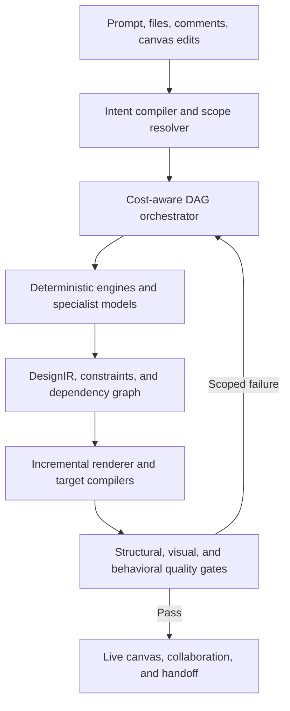

# Design Fabric

## A research-backed modular visual creation system beyond Claude Design

**Product and technical blueprint**  
**Research cutoff:** 28 August 2026  
**Scope:** conversational creation of prototypes, slides, one-pagers, marketing assets, and interactive visual experiences

### Contents

- [Executive thesis](#executive-thesis)
- [Claude Design audit](#1-what-claude-design-publicly-offers)
- [Adjacent products and research](#2-what-adjacent-products-and-research-reveal)
- [Core diagnosis](#3-the-core-diagnosis-visual-creation-currently-bundles-too-many-jobs)
- [Proposed Design Fabric architecture](#4-proposed-system-design-fabric)
- [DesignIR](#5-designir-the-canonical-visual-intermediate-representation)
- [Module mesh](#6-the-module-mesh)
- [Routing, cascading, and budgets](#7-routing-cascading-and-budgets)
- [Dependency-aware editing](#8-dependency-aware-incremental-editing)
- [Enhanced user experience](#9-the-enhanced-user-experience)
- [Design-system ingestion](#10-design-system-ingestion-from-uploads-to-a-design-system-graph)
- [Artifact pipelines, rendering, and quality](#11-artifact-specific-pipelines)
- [Training, interfaces, security, and performance](#14-training-and-data-strategy-for-the-smaller-modules)
- [MVP, roadmap, team, and risks](#19-recommended-mvp)
- [Decisive recommendation](#24-decisive-recommendation)
- [Research sources](#25-research-sources)

---

## Executive thesis

Claude Design establishes a compelling interaction model: describe an idea, receive a working visual draft, and refine it through conversation, inline comments, direct canvas editing, and generated adjustment controls. It can ingest codebases and design files, build from a team design system, export to multiple formats, and hand work to Claude Code. Anthropic publicly says the launch version is powered by Claude Opus 4.7. It does **not** publicly document whether every operation uses that model, whether smaller models are already involved, or what internal representation and rendering architecture it uses. This blueprint therefore improves the **publicly observable workflow**; it does not claim to reverse-engineer Anthropic's implementation.

The recommended next-generation architecture is not “a bigger model with more tools.” It is a **visual compiler with a modular intelligence mesh**:

1. Convert prompts, files, code, comments, and direct edits into a typed, inspectable **Intent Graph**.
2. Maintain every artifact as a canonical, editable **DesignIR**—a semantic scene graph containing content, components, tokens, constraints, interactions, provenance, and stable node IDs.
3. Route each task to the **smallest sufficient specialist** or deterministic engine.
4. Exchange **typed patches**, not prose and not whole regenerated files.
5. Recompute only the affected dependency subgraph.
6. Validate every change with deterministic tests first, a compact visual critic second, and a frontier model only when ambiguity or quality failure justifies it.
7. Compile the same source artifact into canvas, SVG, HTML, PDF, PPTX, code, or partner formats with an explicit fidelity report.

This changes the economics and feel of the product. Dragging, resizing, spacing, token changes, text edits, reflow, accessibility checks, and most comment-driven revisions should happen locally or through compact specialists. The frontier model becomes the creative director for ambiguous goals and major conceptual changes—not the pixel engine for every turn.

### The five fundamental shifts

| Current pattern | Proposed shift | Why it matters |
|---|---|---|
| Conversation is the implicit source of truth | Explicit, editable Intent Graph | Prevents forgotten requirements and repeated prompting |
| Large-context, whole-artifact generation | Stable DesignIR plus scoped patches | Makes edits faster, cheaper, safer, and reversible |
| One general model is asked to do many jobs | Router, deterministic tools, compact specialists, frontier escalation | Matches compute to task difficulty |
| Brand sources are repeatedly interpreted | Versioned Design System Graph built once and updated incrementally | Eliminates repeated repository/file ingestion and design drift |
| Export is a terminal conversion | Target compilers with fidelity contracts and round-trip IDs | Preserves design intent through engineering and other tools |

### Realistic product targets—not claimed results

These are engineering targets to validate with prototypes and telemetry, not promises about current Claude Design or guaranteed improvements:

- **0 model tokens** for direct text/property edits, dragging, resizing, alignment, token swaps, and constraint-preserving reflow.
- **Under 300 ms p50** visual feedback for direct edits and semantic sliders.
- **Under 1 second p50** for a localized natural-language edit after model warm-up.
- **Under 4 seconds p95** for component- or section-level semantic changes.
- **5–20× fewer model tokens per iterative edit** compared with a generic whole-document regeneration baseline.
- **Frontier-model escalation on fewer than 10–15% of edit turns** after the specialist system matures.
- **Below 1% collateral node-change rate** for explicitly localized edits.
- **At least 95% design-token coverage** where a mature team design system exists.
- **Zero known blocking WCAG 2.2 AA violations** at export for supported artifact types.

The system should be marketed on measured workflow outcomes—time to accepted design, edit locality, brand compliance, handoff fidelity—not a vague “100×” claim.

---

## 1. What Claude Design publicly offers

Anthropic launched Claude Design on 17 April 2026 as an Anthropic Labs product for designs, prototypes, slides, one-pagers, and other polished visual work. The official launch describes the following loop: prompt → first version → conversational refinement, inline comments, direct edits, or Claude-generated sliders. It also describes organization design systems, imports, collaboration, export, and Claude Code handoff. ([Anthropic launch](https://www.anthropic.com/news/claude-design-anthropic-labs))

### Public feature map

| Area | Publicly documented behavior | Architectural implication |
|---|---|---|
| Creation | Text prompt, images, documents, codebases, and web capture can seed a project | The product needs multimodal ingestion and source provenance |
| Design systems | Claude extracts colors, typography, components, and layout patterns from codebases, decks, documents, and assets | A reusable design-system representation is central, not optional |
| Canvas | Chat on the left and working canvas on the right | Natural language and direct manipulation must share one state model |
| Refinement | Chat for broad changes, comments for targeted changes, direct editing for visual changes | Scope detection should choose different execution paths |
| Controls | Claude can create custom adjustment sliders | Parameters need declarative bindings to real tokens and constraints |
| Collaboration | Organization-scoped view, comment, and edit access | Stable identities, concurrent state, and permission-aware operations are required |
| Versioning | Users can ask Claude to save a direction before exploring another | Branching should be first-class rather than hidden in conversation |
| Export | ZIP, PDF, PPTX, standalone HTML, Canva, partner tools, and Claude Code handoff | A canonical representation plus target compilers is more scalable than pairwise conversions |
| Code bridge | `/design-sync`, a Claude Design MCP server, and handoff to Claude Code | Design and code should be two projections linked by persistent component/node IDs |

Anthropic's help material says Claude Design can pull a design system from GitHub, design files, raw uploads, or a local codebase; use real components; check its own output against the system; and make corrections before showing it. It also describes an MCP route between Claude Code and Claude Design. ([Getting started](https://support.claude.com/en/articles/14604416-get-started-with-claude-design))

### Publicly documented limitations and operational friction

The current help center identifies several beta limitations:

- Inline comments can fail to persist or appear reliably.
- Very large repositories can introduce browser lag or related issues.
- Multi-person editing is still basic and may be unreliable.
- Design-system quality depends heavily on the quality of its source material.
- Complex projects and repeated iterations consume shared Claude usage.
- The enterprise admin guide says audit logs are not yet supported and data residency is not currently supported.

These are useful signals for architecture. They point toward durable semantic comment anchors, incremental repository indexing, a CRDT/operation model for collaboration, confidence-aware design-system extraction, granular computation, and a complete enterprise event trail. ([Claude Design guide](https://support.claude.com/en/articles/14604416-get-started-with-claude-design), [admin guide](https://support.claude.com/en/articles/14604406-claude-design-admin-guide-for-team-and-enterprise-plans))

### What is not public

The reviewed sources do not establish:

- whether Opus 4.7 handles every edit or only orchestration and difficult tasks;
- whether Anthropic already uses compact models, retrieval modules, deterministic solvers, or model cascades;
- the internal canvas schema, renderer, caching strategy, or export architecture;
- the exact semantics of generated sliders;
- whether edits are represented as scoped patches or artifact regeneration internally.

The blueprint below treats these as open design choices and clearly labels new proposals.

---

## 2. What adjacent products and research reveal

The market is converging on four valuable ideas, but no public system combines them into one open, typed, cost-aware architecture.

### 2.1 Structured, editable output is becoming mandatory

Canva AI 2.0 describes “layered object intelligence”: generated work consists of editable objects, and a requested change is intended to alter only the target element. Canva's Magic Layers also reconstructs flat images into editable text, foreground objects, backgrounds, and preserved layout relationships. This confirms that static image generation is no longer an adequate core representation. ([Canva AI 2.0](https://www.canva.com/newsroom/news/canva-create-2026-ai/), [Magic Layers](https://www.canva.com/newsroom/news/magic-layers/))

CreatiPoster independently supports the same conclusion in research: it represents a design as an executable JSON program of ordered text and asset layers, renders those layers deterministically, and synthesizes the background separately so text and supplied assets remain editable and intact. ([CreatiPoster](https://arxiv.org/html/2506.10890v2))

### 2.2 Production components are better than visual imitations

Figma Code Connect maps design components and properties to actual production components, including one design component mapped to React, SwiftUI, Jetpack Compose, Vue, or other implementations. Figma's MCP tooling can expose components, variables, auto layout, and design context directly to coding agents. UXPin Merge similarly renders production code components inside the design environment. ([Figma Code Connect](https://help.figma.com/hc/en-us/articles/23920389749655-Code-Connect), [Figma MCP](https://help.figma.com/hc/en-us/articles/32132100833559-Guide-to-the-Figma-MCP-server), [UXPin Merge](https://www.uxpin.com/merge))

The implication is stronger than “import the design system.” A next-generation system should prefer **component retrieval and composition** over regenerating approximations, and should preserve prop/state mappings through handoff.

### 2.3 Modular generation can improve control and efficiency

PrototypeFlow interviewed professional UI/UX designers and identified five recurring needs: streamlined trend/brand-aware workflows, better input control and output editability, help expressing intent, precise generation control, and thematic consistency. Its architecture uses a central theme module plus separate text, image, and icon modules, with local regeneration for element-specific edits. ([PrototypeFlow](https://arxiv.org/html/2412.20071v3))

LGGPT shows why specialist scale matters. It uses a compact layout instruction/response format and reports that a 1.5B-parameter layout model matched or exceeded much larger 7B and 175B approaches across its tested layout domains. This does not prove that 1.5B is universally optimal, but it is strong evidence that geometry should not automatically be delegated to the largest available model. ([LGGPT](https://arxiv.org/html/2502.14005v1))

Dynamic routing research distinguishes routing—selecting the best model up front—from cascading—starting with a cheaper model and escalating when verification fails. Production systems often combine both to balance cost, latency, and quality. ([Dynamic Model Routing and Cascading survey](https://arxiv.org/html/2603.04445v2))

### 2.4 Deterministic systems remain superior for exact work

Cassowary is an incremental constraint solver designed for interactive user-interface relationships. It can maintain required and preferred linear constraints and efficiently update values as edits occur. A model can decide **which** constraints express an intent; it should not repeatedly hallucinate every pixel coordinate. ([Cassowary toolkit](https://constraints.cs.washington.edu/cassowary/))

SLEDGE's layered design research reaches a similar conclusion for text: it uses deterministic text rendering rather than diffusion because generative image models struggle with legibility and exact text. It also confines visual regeneration to the modified region. ([Step-by-step Layered Design Generation](https://arxiv.org/html/2512.03335v1))

### 2.5 Evaluation must inspect elements, not just the overall screenshot

Design2Code found that code similarity is a poor proxy for rendered fidelity and proposed a combination of global visual similarity and element-level measures covering block matching, text, position, and color. Its experiments also found that extracting text separately reduces the OCR burden on a general multimodal model, while self-revision remains difficult for many models. ([Design2Code](https://arxiv.org/html/2403.03163v3))

This supports a layered verifier: deterministic structural tests, specialized OCR/text checks, visual-element comparison, and only then an open-ended visual judgment model.

### 2.6 Interoperability standards now provide usable foundations

- The stable Design Tokens Format Module 2025.10 defines a platform-agnostic JSON exchange format for design decisions, aliases, groups, types, and extensions. ([DTCG 2025.10](https://www.designtokens.org/TR/2025.10/format/))
- JSON Patch provides a standard representation for ordered partial modifications to JSON documents. ([RFC 6902](https://datatracker.ietf.org/doc/html/rfc6902))
- SVG provides a structured, scalable representation for two-dimensional vector and mixed vector/raster graphics. ([SVG 2](https://www.w3.org/TR/SVG2/))
- MCP provides schema-described tools and resources for model-to-system interoperability, with human-in-the-loop security guidance. ([MCP tools specification](https://modelcontextprotocol.io/specification/2026-07-28/server/tools))
- WCAG 2.2 defines machine-checkable requirements such as minimum contrast and target size that should be enforced by validators, not left to visual taste. ([WCAG 2.2](https://www.w3.org/TR/WCAG22/))

---

## 3. The core diagnosis: visual creation currently bundles too many jobs

A request such as “make this dashboard feel premium, tighten the cards, keep our brand, and make it work on mobile” silently contains many distinct tasks:

1. understand ambiguous intent;
2. identify the affected artifact and scope;
3. retrieve brand rules and production components;
4. choose an information hierarchy;
5. generate or revise copy;
6. solve responsive geometry;
7. select or generate imagery and icons;
8. maintain typography and color consistency;
9. author interaction behavior;
10. render the result;
11. test accessibility, overflow, breakpoints, and behavior;
12. explain, version, collaborate, and export.

A large multimodal model can attempt all twelve, but asking it to do so on every turn creates four structural inefficiencies:

- **Context tax:** the model repeatedly rereads project, design-system, and artifact context.
- **Regeneration tax:** a localized change can cause unrelated content or geometry to drift.
- **Reasoning tax:** deterministic tasks consume probabilistic-model compute.
- **verification tax:** the same expensive model may generate and judge its own work without precise postconditions.

The fix is not dozens of autonomous agents chatting to one another. That would add coordination tokens, latency, and failure modes. The fix is a **compiler architecture** in which modules behave like typed functions and communicate through one canonical state.

---

## 4. Proposed system: Design Fabric

### 4.1 Product definition

**Design Fabric** is a multimodal visual creation environment that turns user intent into a versioned semantic artifact, then incrementally compiles it into interactive previews and deliverable formats. It supports manual creation, AI generation, collaboration, and engineering handoff without treating any one model or file format as the source of truth.

### 4.2 Design principles

1. **Semantic before visual.** Capture goals, hierarchy, components, states, and constraints before pixels.
2. **One canonical state.** Chat, canvas, code, comments, and exporters operate on DesignIR.
3. **Patch, do not repaint.** Preserve everything outside the computed impact set.
4. **Deterministic by default.** Use models only where judgment, language, or perception is necessary.
5. **Smallest sufficient intelligence.** Route and cascade based on predicted difficulty, confidence, latency, cost, privacy, and risk.
6. **Components before invention.** Retrieve approved components and assets before synthesizing new ones.
7. **Constraints over coordinates.** Express responsive relationships, not isolated x/y values.
8. **Visible uncertainty.** Show conflicts, inferred rules, unsupported exports, and low-confidence mappings.
9. **Every operation is reversible.** Human and AI changes are atomic, attributed, and branchable.
10. **Open core, extensible profiles.** Share a common kernel while letting UI, slides, marketing, documents, video, shaders, and 3D define profile-specific nodes.

### 4.3 Logical architecture



The DesignIR is the system's blackboard. Modules never need to converse in free-form prose with one another. They receive a typed task envelope, read only the relevant slice, and return validated patches plus diagnostics.

### 4.4 The intelligence hierarchy

| Tier | Typical mechanisms | Best uses | Deployment |
|---|---|---|---|
| Tier 0: deterministic | Parsers, ASTs, token resolver, constraint solver, line breaking, renderer, linters, exporters | Exact, repetitive, testable operations | Browser/WASM, desktop, or service |
| Tier 1: tiny/classical | Rules, gradient-boosted router, OCR, embeddings, classifiers, compact grounders | Scope, retrieval, matching, difficulty estimation | Local when possible |
| Tier 2: compact specialists | Roughly 1–8B text/VLM/layout models, task-tuned | Intent compilation, layout, copy, interaction plans, localized visual critique | Device, edge, or low-cost cloud |
| Tier 3: frontier | Most capable multimodal reasoning/generation model available | Ambiguous briefs, radical concepts, cross-domain synthesis, difficult recovery | Cloud/VPC with explicit budget |

Parameter counts are deployment hypotheses, not hard-coded product requirements. Each module earns its place through a quality/latency/cost curve on real design tasks.

---

## 5. DesignIR: the canonical visual intermediate representation

### 5.1 Why an intermediate representation is the leverage point

HTML is too implementation-specific for slides and freeform graphics. SVG is excellent for two-dimensional rendering but does not natively encode product intent, component APIs, responsive behavior, data bindings, or engineering provenance. A proprietary editor tree is difficult to exchange. The system therefore needs a **semantic kernel** that can lower into SVG, HTML, PPTX, PDF, Figma-like layers, or code.

DesignIR should be:

- typed and versioned;
- human-inspectable;
- machine-validatable;
- patchable with stable addresses;
- format-neutral at the kernel;
- extensible by artifact profiles;
- able to retain vendor-specific data without corrupting the common representation;
- deterministic to render for a fixed revision, font set, asset set, and target profile.

### 5.2 Core project graph

| Entity | Purpose |
|---|---|
| `Brief` | Goal, audience, message, deliverable, constraints, success criteria, unresolved decisions |
| `Artifact` | One prototype, deck, one-pager, campaign set, or other deliverable |
| `Artboard` | Screen, slide, page, channel rendition, or viewport-specific canvas |
| `Node` | Frame, text, vector, asset, component instance, chart, media, effect, or profile extension |
| `Constraint` | Required/preferred layout, sizing, alignment, visibility, and responsive relationships |
| `TokenRef` | Semantic design-token reference rather than copied literal value |
| `ComponentRef` | Versioned link to a design/code component, props, states, and supported targets |
| `ContentRef` | Text/content object with locale, evidence, legal status, and data-binding information |
| `InteractionGraph` | States, events, transitions, conditions, side effects, and test scenarios |
| `DependencyEdge` | Records which nodes and decisions are affected by another value |
| `Lock` | Protects geometry, content, style, interaction, asset, or full subtree |
| `Provenance` | Source file, code symbol, URL, user, model/module, license, and timestamp |
| `Decision` | Accepted/rejected design choice, rationale, confidence, and scope |
| `Revision` | Atomic operations, parents, author, intent, validation results, and cost |

### 5.3 Shared kernel plus artifact profiles

Do not force every artifact into a lowest-common-denominator scene graph. Use a shared kernel and extensions:

- **UI profile:** components, props, semantic DOM role, responsive constraints, interaction states, data bindings, routes, and test cases.
- **Slide profile:** narrative role, slide purpose, speaker notes, sequence dependencies, chart/data sources, transitions, and master layouts.
- **One-pager/document profile:** reading order, print constraints, columns, footnotes, pagination, and accessibility tagging.
- **Marketing profile:** campaign concept, channel, safe zones, CTA, legal copy, localization, variants, and delivery specs.
- **Frontier-media profile:** video timeline, audio cues, shader graph, 3D scene reference, AI capability, and fallback representation.

### 5.4 Illustrative DesignIR fragment

```json
{
  "schema": "designir/0.1",
  "revision": "rev_0184",
  "artifact": {
    "id": "checkout-flow",
    "profile": "ui.web",
    "designSystem": "acme-ds@8f32c1a"
  },
  "nodes": {
    "checkout.submit": {
      "type": "component-instance",
      "component": "ds.button.primary",
      "props": {"label": {"contentRef": "copy.checkout.pay"}},
      "style": {
        "paddingInline": {"token": "space.4"},
        "minHeight": {"token": "control.height.lg"}
      },
      "constraints": ["inside:checkout.actions", "align:end"],
      "locks": {"component": true, "content": false, "layout": false},
      "provenance": [{"kind": "code", "ref": "src/ui/Button.tsx#Primary"}]
    }
  },
  "interactions": {
    "checkout.submit.click": {
      "from": "checkout.ready",
      "event": "click:checkout.submit",
      "to": "checkout.processing",
      "guards": ["form.valid"],
      "effects": ["payment.authorize"]
    }
  }
}
```

### 5.5 Patch envelope

Use RFC 6902-compatible operations inside a richer envelope:

```json
{
  "baseRevision": "rev_0184",
  "intentId": "comment_4821",
  "scope": ["checkout.submit"],
  "locksRespected": true,
  "patch": [
    {
      "op": "replace",
      "path": "/nodes/checkout.submit/style/paddingInline/token",
      "value": "space.5"
    }
  ],
  "affected": ["checkout.submit", "checkout.actions"],
  "module": "style-patch@2.3.1",
  "confidence": 0.98,
  "diagnostics": [],
  "provenance": {"actor": "ai", "trigger": "inline-comment"}
}
```

The envelope supplies optimistic concurrency, intent attribution, lock verification, scope, diagnostics, and provenance. The patch remains portable and atomic.

---

## 6. The module mesh

### 6.1 Rule: modules are typed workers, not conversational agents

Every module should:

- declare accepted schemas and emitted schemas;
- receive only the relevant project slice;
- have a latency, cost, memory, privacy, and permission class;
- emit patches or analysis, never silently mutate global state;
- provide calibrated confidence and explicit diagnostics;
- be independently benchmarked and replaceable;
- expose deterministic cache keys;
- declare fallbacks and escalation conditions.

### 6.2 Recommended modules

| ID | Module | Mechanism | Main responsibility | Typical trigger |
|---|---|---|---|---|
| `R0` | Task router | Rules + compact classifier | Predict task family, difficulty, scope, privacy, and cheapest viable path | Every request |
| `G0` | Source grounder | Parsers, OCR, compact VLM | Convert screenshots, docs, design files, and web captures into evidence-linked structure | Import |
| `DS0` | Design-system indexer | ASTs, manifests, token parser, embeddings | Build the Design System Graph from code, tokens, examples, and docs | Onboarding/change |
| `I1` | Intent compiler | 1–3B text model + schema constraints | Turn natural language into Brief/Intent Graph fields and confidence | Prompt/comment |
| `S0` | Scope resolver | Stable IDs, selection state, graph matching, compact ranker | Resolve “this,” “the cards,” or a comment anchor to exact nodes | Edit |
| `IA1` | Information architect | 3–8B specialist | Create artifact outline, screen/slide/page roles, and hierarchy | New artifact/major restructure |
| `L1` | Layout planner | ~1.5B layout specialist | Propose boxes, grouping, hierarchy, and responsive relationships | New layout/variant |
| `LC0` | Layout compiler | Incremental constraint solver | Turn layout intent into exact geometry and preserve constraints during edits | Every geometry change |
| `T0` | Token resolver | Deterministic | Resolve aliases, themes, modes, fallbacks, and platform transforms | Style/render/export |
| `ST1` | Style director | 1–3B specialist + retrieval | Select token families and parameterized visual direction | Theme/style change |
| `C1` | Copy specialist | 1–3B language model | Headlines, labels, body copy, summaries, tone, and length variants | Content creation/edit |
| `A0` | Asset retriever | Embeddings + policy filters | Search approved logos, icons, photos, illustrations, and prior assets | Asset need |
| `A1` | Asset generator | Dedicated image/vector model | Generate only missing visual assets with masks/layers and provenance | Retrieval failure/creative need |
| `X1` | Interaction planner | 1–3B model + state-machine schema | Events, states, validation, transitions, edge cases, and tests | Prototype behavior |
| `D0` | Data/chart engine | Deterministic chart grammar + optional small planner | Bind data and select valid chart structures | Data-driven design |
| `P0` | Patch planner | Compact model + dependency graph | Translate a semantic request into minimal operations and affected closure | Natural-language edit |
| `TX0` | Text engine | Deterministic shaping/line breaking | Exact text, typography, overflow, hyphenation, and localization layout | Render/reflow |
| `V0` | Canvas renderer | GPU/Skia/SVG/DOM | Incremental preview with stable node hit-testing | Every revision |
| `Q0` | Structural validator | Deterministic rules | Schema, overlaps, overflow, token use, a11y, component rules, broken links | Every patch/export |
| `Q1` | Visual critic | Compact VLM + element metrics | Hierarchy, reference match, asset fidelity, local visual anomalies | Candidate validation |
| `Q2` | Frontier reviewer | Frontier multimodal model | Resolve ambiguous failures, global coherence, novel art direction | Escalation only |
| `E0` | Target compiler | Deterministic + target adapters | SVG, HTML, PDF, PPTX, Figma/Canva-like structures, code bundles | Export/handoff |
| `C0` | Collaboration engine | Operation log + CRDT | Presence, concurrent edits, comments, branches, merges | Multi-user editing |
| `M0` | Preference ledger | Structured memory + embeddings | Persist explicit preferences and accepted/rejected decisions by scope | Approved choice |
| `SEC0` | Policy/security gate | Deterministic policy engine | Permissions, connector scopes, asset rights, code sandbox, data policy | Import/tool/export |

### 6.3 What should run locally

The browser or desktop runtime should own:

- direct manipulation and hit testing;
- constraint reflow;
- token resolution;
- text shaping;
- DesignIR patches and undo/redo;
- structural validation;
- incremental rendering;
- lightweight scope resolution;
- CRDT state and presence;
- redaction before remote calls.

The local runtime should be fully productive while model responses stream. Users should never wait for a language model to move a rectangle or change a literal text value.

### 6.4 What should use compact models

Compact models should handle bounded semantic problems with strong schemas:

- prompt/comment → structured intent;
- brief → page/screen/slide hierarchy;
- constraints → layout proposal;
- node selection + request → patch plan;
- copy within exact character and tone constraints;
- interaction intent → state machine;
- rendered candidate → focused quality judgment.

They should be distilled and fine-tuned on accepted design operations, not asked to generate whole applications in free-form code.

### 6.5 When a frontier model is justified

Escalate when one or more of these holds:

- the brief has unresolved strategic ambiguity with high downstream impact;
- the user requests radical novelty rather than refinement;
- multiple artifact types must share one campaign or narrative concept;
- compact modules disagree or fail postconditions twice;
- global coherence requires reasoning across many screens/slides and sources;
- the user explicitly selects “maximum creative depth”;
- risk or uncertainty exceeds the configured threshold.

Even then, the frontier model should return a structured plan or patches. It should not bypass DesignIR.

---

## 7. Routing, cascading, and budgets

### 7.1 Selection objective

For task `t` and candidate execution path `p`, choose the path that maximizes:

\[
U(p \mid t) = \hat{Q}(p,t) - \lambda_c C(p) - \lambda_l L(p) - \lambda_r R(p)
\]

subject to:

\[
P(\text{postconditions pass} \mid p,t) \ge q_{\min}
\]

where:

- `Q` is predicted quality;
- `C` is monetary/compute cost;
- `L` is latency;
- `R` is privacy, security, or irreversible-change risk;
- `q_min` is set by the artifact stage—low for disposable exploration, high for export.

### 7.2 Route first, cascade second

1. `R0` classifies task type, scope, difficulty, and modality.
2. The scheduler selects the cheapest plausible module path.
3. Modules execute against a frozen base revision.
4. `Q0` checks exact postconditions.
5. `Q1` evaluates visual/semantic criteria only if needed.
6. If confidence is low or a gate fails, escalate the **affected subgraph**, not the whole project.
7. Frontier output is again validated before commit.

### 7.3 Example routes

| User action | Route | Frontier call? |
|---|---|---|
| Drag a card 16 px lower | Canvas → constraint solver → patch → render | No |
| Change “Start free” to “Create account” | Text engine → patch → overflow check | No |
| “Make these four cards denser” with cards selected | Scope resolver → style/spacing specialist → token patches → solver | Usually no |
| “Show three substantially different dashboard structures” | Intent compiler → IA specialist → layout specialist ×3 → validators | Only if compact paths fail or novelty mode is high |
| “Invent a visual language unlike our current brand but still recognizable” | Frontier concept director → structured theme proposals → compact realization | Yes |
| “This export does not match the production component behavior” | Component mapper → interaction validator → target compiler; frontier diagnosis if unresolved | Maybe |

### 7.4 Cache hierarchy

Use multiple caches rather than only prompt caching:

1. **Immutable source cache:** parsed code symbols, document structure, fonts, assets, and hashes.
2. **Design-system cache:** component/tokens graph keyed by repository commit and source versions.
3. **Retrieval cache:** embeddings and nearest-neighbor results by approved corpus version.
4. **Module-result cache:** exact input slice + module/version + policy + seed.
5. **Render cache:** node/subtree output keyed by DesignIR hash, viewport, theme, locale, and font set.
6. **Model prefix cache:** stable system instructions, schemas, and design-system summaries. Anthropic's public API documentation confirms prompt-prefix caching can reduce repeated processing cost and latency. ([Prompt caching](https://docs.anthropic.com/en/docs/build-with-claude/prompt-caching))

The largest savings come from **not sending irrelevant state at all**. Prefix caching helps, but dependency-scoped context is more fundamental.

---

## 8. Dependency-aware incremental editing

### 8.1 Change-impact graph

DesignIR should explicitly record relationships such as:

- token → component definition → instances → artboards;
- content length → text box → card height → grid row → page height;
- component prop → interaction state → test case;
- brand mode → token aliases → all affected visual properties;
- viewport → responsive rule → component visibility/order;
- data schema → chart encoding → legend/layout;
- locale → content → line breaks → layout.

When an operation arrives:

1. resolve the target scope;
2. compute downstream dependency closure;
3. subtract locked nodes and unchanged cached subgraphs;
4. schedule only the necessary modules;
5. render only changed subtrees;
6. run local and ancestor-level validators;
7. commit one atomic revision.

### 8.2 Edit locality contract

Every operation must declare one of four scopes:

| Scope | Meaning | Default preservation rule |
|---|---|---|
| Property | One property on one node | Everything else byte/semantically stable |
| Node/subtree | A selected component or section | Siblings preserved unless constraints require reflow |
| Theme/system | Tokens or component rules | Content and structure preserved |
| Artifact/global | Information architecture, campaign concept, or broad direction | Explicit locks still preserved |

If the requested change cannot be completed within scope, the system shows the required expansion before applying it: “Increasing this text requires the parent card and row to grow.”

### 8.3 Stable comment anchors

An inline comment should store:

- stable node ID and optional property path;
- selected text range or vector subpath when relevant;
- artboard and revision;
- fallback normalized canvas coordinates;
- semantic fingerprint for rebinding after structural changes;
- status, thread, assignee, and applied revision.

If the target node is deleted or split, the comment becomes “needs re-anchor” rather than disappearing. This directly addresses the class of persistence issue in Claude Design's beta documentation.

### 8.4 Atomic operations and collaboration

Use an operation log and CRDT-compatible shared types so people and AI can edit concurrently. The AI should act as a named collaborator that proposes or applies operations under the same permission and revision rules as a human. Yjs is one practical implementation option; its shared types and awareness model are designed for collaborative application state. ([Yjs](https://yjs.dev/))

Branches are cheap because a branch is a base revision plus operations. Section-level merging should compare semantic node IDs and properties, not flattened images.

---

## 9. The enhanced user experience

### 9.1 Entry: from blank prompt to inspectable brief

The user can begin with text, voice, sketch, screenshot, a document/deck, data, a URL capture, or a codebase. The system immediately compiles an editable brief with:

- artifact type and channels;
- intended audience and job-to-be-done;
- message/content requirements;
- desired interaction and data behavior;
- design system and brand mode;
- hard constraints and preferences;
- required breakpoints, locales, and accessibility level;
- references with “copy,” “adapt,” or “avoid” intent;
- unresolved decisions ranked by downstream impact.

The system asks only **high-value clarification questions**—questions whose answers are likely to change structure, brand, legal compliance, or delivery. Low-impact ambiguity becomes reversible variants instead of conversation friction.

### 9.2 Progressive creation instead of a blank wait

Render in stages:

1. **Immediate skeleton:** hierarchy, artboards, and component placeholders.
2. **System pass:** real components, tokens, type scale, and constraints.
3. **Content pass:** copy, data, icons, and approved assets.
4. **Polish pass:** imagery, motion, effects, and micro-interactions.
5. **Verification pass:** responsiveness, accessibility, interactions, and export readiness.

Each stage is editable. A user can stop a wrong direction before expensive asset generation.

### 9.3 Variation Lattice

Do not generate three unrelated complete designs. Decompose variation into orthogonal axes:

- structure;
- density;
- typography;
- color/theme;
- imagery style;
- content tone;
- motion/interaction;
- brand strictness;
- novelty.

Variants share the same base graph and differ by compact patch sets. Users can lock axes, compare only one dimension, or merge “structure from B, typography from C, imagery from A.” This gives broader exploration with much less computation and far better causal understanding.

### 9.4 Intent Map

The brief, design decisions, and canvas are bidirectionally linked:

- clicking “trusted enterprise audience” highlights choices made because of it;
- clicking a component shows which requirement, token, and source justified it;
- changing “mobile-first” previews the affected constraints before commit;
- unsupported or weakly grounded choices display low-confidence badges.

This is more useful than exposing private chain-of-thought. It exposes **design state, evidence, decisions, constraints, and consequences**.

### 9.5 Semantic sliders that cost no tokens while dragging

Generated sliders should compile into parameter bindings, not repeated prompts. Examples:

- **Density:** spacing scale, row gaps, card padding, control heights, and type leading.
- **Playfulness:** radius family, illustration ratio, color saturation, type contrast, and motion spring.
- **Brand strictness:** approved component/asset percentage and token deviation budget.
- **Information emphasis:** headline scale, primary metric weight, whitespace allocation, and secondary-content opacity.
- **Motion:** duration tokens, easing, parallax depth, and transition count, bounded by reduced-motion rules.

The UI shows exactly which parameters a slider controls. Dragging runs local token resolution, constraints, and rendering. AI is invoked only to create or reinterpret the slider definition.

### 9.6 Locks and invariants

Every node or subtree can lock:

- content;
- layout;
- style;
- component identity;
- interaction;
- asset;
- brand compliance;
- full state.

Natural-language commands inherit the current selection and locks. The user can say: “Explore a new hero, but lock the headline, logo, CTA wording, and product screenshot.” The system proves locks were respected before commit.

### 9.7 Design lenses

The same canvas can be inspected through task-specific overlays:

- **Intent:** requirement coverage and unresolved decisions.
- **Brand:** token/component compliance and source confidence.
- **Accessibility:** contrast, target size, focus order, semantics, motion, and reading order.
- **Engineering:** component mapping, unsupported nodes, state/data bindings, and estimated implementation complexity.
- **Performance:** asset weight, font cost, shader/video cost, and responsive rendering risk.
- **Localization:** expansion, wrapping, RTL, font coverage, and locale-specific assets.
- **Provenance:** asset source, license, model/module, and factual content evidence.

### 9.8 What changed, why, and what it cost

Every AI revision should summarize:

- intended change;
- exact affected nodes/properties;
- collateral reflow;
- locks preserved;
- checks passed/failed;
- compute route and rough usage class;
- one-click undo or branch.

This builds trust without overwhelming the user with implementation logs.

---

## 10. Design-system ingestion: from uploads to a Design System Graph

### 10.1 Evidence hierarchy

Not all inputs deserve equal authority. Default precedence should be configurable but start with:

1. **Production code and component manifests:** functional behavior and real API truth.
2. **Stable DTCG token files:** semantic style truth.
3. **Approved design libraries:** visual/component intent.
4. **Official brand guidelines and templates:** communication rules and examples.
5. **Finished products and screenshots:** observed evidence, potentially stale.
6. **Informal decks and arbitrary uploads:** weak evidence until approved.

### 10.2 Ingestion pipeline

1. Fingerprint sources and detect versions.
2. Parse source-native structure before using vision.
3. Extract tokens, components, props, states, variants, responsive behavior, code locations, examples, assets, and guidelines.
4. Normalize tokens to DTCG 2025.10 where possible while preserving vendor extensions.
5. Map design components to code components one-to-many across frameworks.
6. Infer only missing metadata and mark it as inferred.
7. Detect conflicts and duplicate concepts.
8. Render component specimens and state matrices.
9. Ask a design-system owner to approve high-impact conflicts.
10. Publish an immutable version and incrementally update it from source diffs.

### 10.3 Design System Graph entities

| Entity | Important fields |
|---|---|
| Token | Semantic name, type, value/alias, mode, source, status, deprecation, platform transforms |
| Component | Canonical ID, design ref, code refs, supported platforms, props, slots, states, variants |
| Pattern | Composition rules, use cases, anti-patterns, accessibility, responsive behavior |
| Asset | Type, variants, safe zones, licensing, approved contexts, localization |
| Guideline | Rule, severity, scope, evidence, examples, exception policy |
| Template | Artifact profile, slots, constraints, required content, approved variants |
| Mapping | Design property ↔ code prop/token ↔ export target representation |
| Confidence | Extracted/declared/inferred status plus source authority and reviewer |

### 10.4 Incremental repository sync

Do not resend a large repository for every project. Index locally or in a controlled service, then update from version-control diffs:

- changed files trigger AST/component/token extraction only for impacted symbols;
- dependency closure identifies components needing new specimens;
- embeddings and summaries are refreshed only for modified entities;
- previous mappings survive renames through symbol/history matching;
- breaking changes invalidate affected DesignIR references and open migration tasks.

This directly reduces the large-codebase context and latency problem.

### 10.5 Brand consistency without creative collapse

Separate three layers:

- **Invariants:** logo treatment, required colors, legal safe zones, forbidden combinations, accessibility minimums.
- **System vocabulary:** tokens, components, typography, patterns, illustration families.
- **Creative envelope:** permitted variation ranges by channel, audience, and campaign.

“Strict brand” constrains all three. “Explore” preserves invariants while widening the creative envelope. This avoids both generic off-brand output and design systems that eliminate novelty.

---

## 11. Artifact-specific pipelines

### 11.1 Interactive prototype pipeline

1. Compile product goal and user journey.
2. Generate route/screen/state map.
3. Retrieve approved components.
4. Fill gaps with provisional components clearly marked as new.
5. Generate responsive constraints and data states.
6. Author interaction graph and test scenarios.
7. Render real component behavior where possible.
8. Simulate loading, empty, error, permission, and extreme-data states.
9. Validate keyboard, focus, semantics, touch targets, contrast, and motion.
10. Handoff with code mappings, state machine, tests, assets, and unresolved gaps.

### 11.2 Slide-deck pipeline

1. Compile objective, audience, decision, time limit, and evidence.
2. Build argument/narrative graph before slide layouts.
3. Assign a purpose to each slide: setup, evidence, comparison, mechanism, decision, close.
4. Separate factual content generation from layout generation.
5. Bind charts to real data and retain source/provenance.
6. Use master layouts and design tokens.
7. Generate controlled layout variants, not unrelated decks.
8. Validate text density, reading order, contrast, image rights, and presenter pacing.
9. Compile to editable PPTX/PDF/HTML with a loss report.

### 11.3 One-pager pipeline

1. Identify the single desired reader action.
2. Build a content hierarchy and evidence map.
3. Allocate print/screen geometry with a constraint solver.
4. Treat copy length as a design constraint.
5. Validate reading order, print margins, links/QR, accessibility tags, and export fidelity.

### 11.4 Marketing-asset pipeline

1. Compile campaign concept, offer, audience, CTA, channels, and legal constraints.
2. Create one campaign graph with channel-specific projections.
3. Preserve approved logos, product shots, disclaimers, and brand invariants.
4. Generate channel variants as patches over shared content and assets.
5. Run safe-zone, crop, length, localization, and platform-spec checks.
6. Record asset provenance and rights.
7. Produce a coherent campaign set rather than isolated files.

### 11.5 Frontier-media pipeline

Voice, video, shaders, 3D, and built-in AI should be plugin profiles with declared capabilities, preview sandboxes, performance budgets, and graceful fallbacks. The core project can reference a `3d.scene` or `shader.graph` node without forcing the base DesignIR to encode every domain-specific detail.

---

## 12. Rendering and compilation

### 12.1 Dual rendering strategy

- Use a canvas/graphics renderer for freeform composition, slides, print, vectors, and mixed media.
- Use DOM/native component renderers for code-authentic UI prototypes.
- Keep both synchronized through DesignIR node IDs and shared constraints/tokens.

Do not pretend a vector mockup and a production component are identical. The canvas indicates whether a node is a real component, a design-only representation, or a generated placeholder.

### 12.2 Target compilers

Each exporter implements:

1. capability negotiation;
2. DesignIR validation for that target;
3. lowering into target-native structures;
4. target render;
5. visual/behavioral comparison;
6. loss and substitution report;
7. embedded round-trip identifiers where the format permits.

### 12.3 Fidelity contract

Every handoff/export bundle should include:

- DesignIR revision and design-system version;
- component/token mappings;
- source and target screenshots by breakpoint/theme/locale;
- interaction/state specification and executable tests where applicable;
- content/data provenance;
- asset manifest, licenses, and generation metadata;
- accessibility report;
- unsupported features and substitutions;
- target-compiler version;
- visual and behavioral fidelity scores;
- unresolved human decisions.

### 12.4 Round-trip strategy

Perfect arbitrary code ↔ design round-tripping is unrealistic. Use a controlled contract:

- mapped production components round-trip by canonical component/prop IDs;
- generated code includes stable `data-design-node` or equivalent metadata in managed regions;
- target-side changes import as operations where mappings are known;
- arbitrary code outside managed regions becomes an external component boundary;
- conflicts are shown rather than silently overwritten.

---

## 13. Quality architecture

### 13.1 Gate 0: schema and safety

- valid DesignIR and target profile;
- no missing required assets/fonts/components;
- locks respected;
- no unauthorized connector or code action;
- sandbox policy satisfied;
- patch applies cleanly to the expected base revision.

### 13.2 Gate 1: deterministic design checks

- overlap, clipping, overflow, off-canvas elements;
- grid/alignment and minimum spacing rules;
- token usage and forbidden literals;
- component prop/state validity;
- text fit, orphan/widow rules where applicable;
- font availability and glyph coverage;
- WCAG contrast, target size, focus, semantics, reading order, reduced motion;
- responsive constraints at all required viewports;
- locale and RTL stress cases;
- chart/data validity;
- broken interactions, routes, or state transitions;
- export-specific requirements.

### 13.3 Gate 2: visual-element evaluation

Use dedicated comparisons rather than one vague aesthetic score:

- required-element recall and hallucinated-element rate;
- text accuracy;
- position, size, alignment, and color difference;
- asset identity/fidelity;
- reference similarity where the user supplied a reference;
- hierarchy and salience;
- style consistency across related nodes/artboards;
- local-change collateral difference.

This follows the spirit of Design2Code's element-level evaluation rather than relying only on global image similarity.

### 13.4 Gate 3: compact visual critic

The compact critic receives:

- relevant brief requirements;
- before/after render crops;
- changed nodes and diagnostics;
- design-system rules;
- deterministic test results.

It answers bounded questions: “Does the CTA remain visually primary?” or “Did this localized edit introduce inconsistent styling?” It should not re-review the entire project unless scope is global.

### 13.5 Gate 4: frontier/human review

Use frontier review for ambiguous global coherence and human review for strategic, legal, brand, and publication decisions. A high-quality system knows which judgment it cannot safely automate.

### 13.6 Evaluation matrix

| Dimension | Metric examples |
|---|---|
| Intent | Required-field coverage, requirement satisfaction, unresolved-decision rate |
| Locality | Changed nodes outside declared scope, perceptual difference outside mask |
| Brand | Token coverage, approved component/asset use, violations by severity |
| Layout | Constraint pass rate, overflow rate, breakpoint robustness |
| Content | Exact-text accuracy, length compliance, factual provenance, localization fit |
| Interaction | State/transition test pass rate, edge-state coverage |
| Accessibility | WCAG 2.2 AA blockers, keyboard path, focus order, reduced motion |
| Visual quality | Pairwise human preference, hierarchy score, element-level similarity |
| Handoff | Component mapping rate, target loss count, visual regression score |
| Efficiency | End-to-end latency, model tokens, frontier escalation rate, cache hit rate |
| Collaboration | Merge-conflict rate, comment-anchor survival, operation convergence |

---

## 14. Training and data strategy for the smaller modules

### 14.1 Train on operations, not only final screenshots

Final designs teach appearance but not controllable editing. The highest-value dataset is a sequence:

`base DesignIR + user intent + selection/locks + accepted patch + rendered before/after + validation results`

Collect or synthesize:

- prompt-to-brief annotations;
- comment-to-node grounding;
- layout constraints and accepted alternatives;
- component retrieval and mapping decisions;
- atomic edit histories;
- rejected and corrected patches;
- responsive/localization transformations;
- interaction state graphs;
- export loss cases;
- designer preference pairs with rationales expressed as structured tags.

SLEDGE's step-by-step dataset direction and PrototypeFlow's editable checkpoints both support training on iterative operations rather than single-shot endpoints.

### 14.2 Distillation plan

1. Use frontier models and expert designers to create/label structured task traces.
2. Validate traces with deterministic renderers and tests.
3. Train compact specialists on bounded schemas.
4. Calibrate confidence using held-out real workflows.
5. Train the router on observed quality, cost, and latency for every available path.
6. Continuously mine frontier escalations for the next specialist-training set.

The frontier model becomes both an execution fallback and a teacher that gradually shrinks its own workload.

### 14.3 Brand adaptation

Prefer retrieval, tokens, components, rules, and examples over per-brand fine-tuning. Optional adapters can learn soft preferences—density, imagery choices, tone—but must not become the sole repository of hard brand rules or exact assets.

### 14.4 Data governance

- Explicit opt-in for using customer operations to improve shared models.
- Tenant-specific preference models remain tenant-scoped.
- Secrets and unnecessary code are redacted before remote inference.
- Assets retain rights/provenance metadata.
- Synthetic data is labeled and evaluated for bias toward template-like aesthetics.
- Training datasets include accessible, multilingual, RTL, low-bandwidth, and non-Western design examples.

---

## 15. Module interface and orchestration contract

### 15.1 Module manifest

```json
{
  "id": "layout-planner",
  "version": "1.4.0",
  "capabilities": ["layout.generate", "layout.repair", "layout.variation"],
  "inputSchema": "design-task/0.1",
  "outputSchema": "design-module-result/0.1",
  "artifactProfiles": ["ui.web", "ui.mobile", "slide", "marketing.static"],
  "deterministic": false,
  "costClass": "compact",
  "latencySloMs": 900,
  "privacy": ["local-eligible", "no-secrets"],
  "permissions": ["read:brief", "read:design-system", "patch:constraints"],
  "cache": {"mode": "content-addressed", "ttl": "30d"},
  "fallbacks": ["layout-planner-large", "frontier-director"],
  "postconditions": ["schema.valid", "constraints.solvable", "locks.respected"]
}
```

### 15.2 Task envelope

```json
{
  "taskId": "task_932",
  "projectId": "project_18",
  "baseRevision": "rev_184",
  "intent": {"kind": "layout.densify", "strength": 0.35},
  "scope": ["dashboard.metric-grid"],
  "locks": ["content", "component-identity"],
  "contextRefs": ["brief:current", "ds:acme@8f32c1a"],
  "budget": {
    "maxLatencyMs": 1500,
    "maxCostUsd": 0.003,
    "minimumConfidence": 0.94,
    "privacy": "local-preferred"
  },
  "targets": [
    {"profile": "ui.web", "viewport": [1440, 900]},
    {"profile": "ui.web", "viewport": [390, 844]}
  ]
}
```

### 15.3 Result contract

```json
{
  "taskId": "task_932",
  "baseRevision": "rev_184",
  "patch": [],
  "affected": [],
  "confidence": 0.97,
  "diagnostics": [],
  "evidence": [],
  "metrics": {"latencyMs": 412, "inputTokens": 286, "outputTokens": 94},
  "cacheKey": "sha256:...",
  "requiresEscalation": false
}
```

### 15.4 Scheduler behavior

- Build a dependency DAG from the intent and expected postconditions.
- Run independent retrieval, copy, layout, and asset tasks concurrently.
- Apply patches to isolated working branches.
- Reject stale results when `baseRevision` no longer matches; rebase safe property patches automatically.
- Resolve patch conflicts by authority and explicit locks, not model confidence alone.
- Stream partial validated revisions to the canvas.
- Cancel downstream work when the user changes direction.
- Record module/version, input hashes, output, checks, latency, and cost in the audit trail.

---

## 16. Security, privacy, and enterprise controls

### 16.1 Threat model

The platform handles untrusted codebases, documents, images, generated HTML/JS, connectors, user data, and collaborative edits. Main risks include:

- prompt injection embedded in imported content;
- arbitrary code execution in previews or exporters;
- cross-tenant data leakage through retrieval or caching;
- unauthorized connector access;
- malicious assets, fonts, or archives;
- IP/licensing violations;
- model-generated tracking/network calls;
- supply-chain compromise in modules/exporters;
- silent brand or policy bypass;
- audit gaps.

### 16.2 Required controls

- Parse code/documents in isolated, resource-limited workers.
- Treat imported instructions as data, never trusted system directives.
- Render executable previews in sandboxed origins/iframes with restrictive CSP, network allowlists, and capability tokens.
- Give every module least-privilege read/patch permissions.
- Keep tenant-specific indexes, caches, models/adapters, and encryption boundaries separate.
- Require explicit confirmation for external publication, connector writes, or code deployment.
- Scan uploads and exports.
- Track asset origin, rights, model generation, and transformations.
- Support retention, deletion, residency, encryption-key, and no-training policies by tenant.
- Produce immutable audit events for source ingestion, model calls, tool calls, patches, approvals, exports, shares, and policy decisions.
- Allow enterprise administrators to restrict models, regions, connectors, asset sources, artifact profiles, and export targets.

### 16.3 Human control

MCP's specification recommends clear tool exposure, visible invocation indicators, and human ability to deny operations. Apply the same principle to every external or privileged Design Fabric action. Internal low-risk canvas operations can be automatic; external side effects cannot be hidden.

---

## 17. Performance and deployment architecture

### 17.1 Hybrid execution

| Layer | Browser/desktop | Edge/VPC | Cloud |
|---|---|---|---|
| DesignIR, patches, undo, selection | Primary | Replication | Persistence |
| Renderer, solver, tokens, text | Primary | Optional headless render | Export render farm |
| OCR/embeddings/router | Prefer local when capable | Primary enterprise option | Fallback |
| 1–8B specialists | Optional on capable hardware | Primary | Multi-tenant service |
| Frontier model | No | Optional private endpoint | Primary managed route |
| Asset generation | Lightweight preview optional | Private generation option | Dedicated GPU service |

### 17.2 Progressive latency budget

| Operation | Target p50 | Execution path |
|---|---:|---|
| Direct property edit | <100 ms | Local patch + render |
| Drag/reflow | <16 ms preview, <100 ms settle | Local constraint solver |
| Semantic slider | <100 ms preview | Local parameter binding |
| Localized comment edit | <1 s | Scope resolver + compact patch model |
| Section redesign | <4 s | Compact layout/style modules + validation |
| Three structural variants | <8 s first previews | Shared IA plan + parallel layout patches |
| Full novel concept | <15–30 s useful first result | Frontier plan + progressive modular realization |

### 17.3 Computation model

For a monolithic baseline, iterative cost tends toward:

\[
C_{mono} \propto \text{project context} + \text{artifact serialization} + \text{generated artifact}
\]

on many turns.

For Design Fabric:

\[
C_{fabric} = C_{route} + \sum_{i \in affected} C_i + C_{validation} + \mathbb{1}_{escalate}C_{frontier}
\]

The affected-set size—not total project size—should dominate routine editing cost.

### 17.4 Observability

Track per task and per module:

- latency and queue time;
- tokens/compute/memory;
- cache hits;
- predicted versus actual confidence;
- validation failures;
- escalation reason;
- user acceptance, undo, and manual correction;
- collateral-change rate;
- design-system compliance;
- export fidelity;
- privacy region and policy route.

Do not optimize for “number of generations.” Optimize for **accepted intent per second and per unit cost**.

---

## 18. Product metrics

### North-star metric

**Median time from initial intent to accepted, handoff-ready artifact**, segmented by artifact type and complexity.

### Supporting metrics

| Category | Metric |
|---|---|
| Creative | Accepted directions per exploration minute; diversity without brand violations |
| Editing | Median turns to acceptance; undo rate; manual correction time; collateral-change rate |
| Efficiency | Tokens and cost per accepted revision; frontier-call share; cache reuse; time to first editable preview |
| Quality | Brand compliance; accessibility pass rate; interaction test rate; export/handoff fidelity |
| Control | Lock violations; scope-expansion warnings; unresolved comment-anchor rate |
| Design systems | Component reuse; token coverage; source conflict resolution time; stale mapping rate |
| Engineering | Mapped component share; generated code replaced after handoff; visual regression failures |
| Trust | Revision explanation usefulness; provenance completeness; policy/audit coverage |

### Critical A/B tests

1. Full regeneration versus dependency-scoped patches.
2. One large model versus router/cascade at equal acceptance quality.
3. Blank prompt versus editable brief with high-value clarification.
4. Unstructured variation generation versus Variation Lattice.
5. Screenshot-based handoff versus component/intent fidelity contract.
6. Model-based layout versus specialist + constraint compiler.
7. Ad hoc sliders versus declarative semantic parameter bindings.

---

## 19. Recommended MVP

### Focus: component-authentic responsive UI prototypes

Start with UI prototypes, not every artifact type simultaneously. UI offers the strongest validation surface: component APIs, states, constraints, accessibility, browser rendering, and interaction tests. The shared kernel can then expand into slides and marketing with less architectural risk.

### MVP capabilities

1. Import a React/TypeScript component library and DTCG tokens.
2. Build and review a versioned Design System Graph.
3. Accept prompt + optional wireframe/screenshot.
4. Compile an editable brief.
5. Generate a screen/flow using real mapped components.
6. Maintain DesignIR with stable IDs, constraints, and interaction states.
7. Support direct edits, semantic sliders, locks, and anchored comments.
8. Translate local comments into scoped patches.
9. Preview desktop/mobile and key UI states.
10. Run structural, token, accessibility, and interaction checks.
11. Branch/compare/merge variants.
12. Export a React handoff bundle with mappings, tests, screenshots, and fidelity report.

### Explicitly defer

- arbitrary 3D/video/shader generation;
- perfect arbitrary-code round trip;
- every presentation and marketing export target;
- unconstrained plugin marketplace;
- automatic public deployment;
- organization-wide preference learning without mature privacy controls.

### MVP proof criteria

- At least 80% of generated UI nodes use real mapped components on selected pilot systems.
- Localized edits alter fewer than 1% of unrelated nodes.
- Routine edit turns use at least 5× fewer model tokens than the selected monolithic baseline at comparable acceptance.
- 90% of common property edits render in under 300 ms.
- No known blocking accessibility, schema, or interaction errors in “handoff ready” status.
- Designers and engineers rate the same handoff revision as acceptably aligned in at least 80% of pilot tasks.

---

## 20. Implementation roadmap

### Phase 0 — Architecture spike, 6–8 weeks

- Define DesignIR 0.1, artifact/profile extension rules, and JSON schemas.
- Implement stable IDs, RFC 6902 patch envelope, locks, revisions, and dependency graph.
- Build local SVG/DOM renderer, token resolver, text engine, and constraint prototype.
- Import one token format and one React component library.
- Benchmark whole-artifact versus patch-based editing.
- Establish the initial evaluation harness.

**Exit:** one responsive screen can be generated, edited locally, validated, versioned, and exported without regenerating unaffected nodes.

### Phase 1 — Useful UI alpha, 8–12 weeks

- Intent compiler, scope resolver, compact layout specialist, and component retriever.
- Design System Graph review UI and incremental source sync.
- Direct canvas, comment anchoring, locks, semantic sliders, and progressive preview.
- Accessibility and responsive validators.
- React/HTML handoff with visual snapshots and mapping manifest.

**Exit:** internal designers can complete real product-flow prototypes with component-authentic output.

### Phase 2 — Modular quality beta, 10–14 weeks

- Cost-aware router/cascade and compact visual critic.
- Variation Lattice, section merge, preference ledger, and collaboration/CRDT.
- Interaction planner and browser-based scenario testing.
- Asset retrieval/generation with provenance.
- Enterprise audit event stream and policy controls.

**Exit:** measured token/latency gains at equal or better human acceptance across pilot teams.

### Phase 3 — Multi-artifact expansion, 12–16 weeks

- Slide, one-pager, and marketing profiles.
- PPTX/PDF/SVG/partner compilers and fidelity reports.
- Campaign graph and cross-channel variants.
- Localization, RTL, print, data/chart, and advanced brand policies.

**Exit:** one brief can produce coherent, editable, source-linked deliverables across formats.

### Phase 4 — Ecosystem and frontier media

- Sandboxed module SDK and registry.
- MCP resources/tools for external systems.
- Private/VPC/on-device specialist deployment.
- Video, shader, 3D, audio, and AI-interaction profile plugins.
- Open DesignIR interchange proposal based on production learning.

---

## 21. Team and ownership model

A serious first-year build likely needs a focused cross-functional group rather than a conventional “AI feature” squad:

- product lead for creator workflows;
- design lead plus product/brand/interaction designers;
- canvas/rendering engineers;
- design-system/code-ingestion engineers;
- distributed state/collaboration engineer;
- compiler/export engineers;
- ML engineers for routing, layout, intent, perception, and evaluation;
- inference/serving engineer;
- accessibility specialist;
- security/privacy engineer;
- developer-experience engineer for modules and handoff;
- evaluation/QA engineers with designer-in-the-loop studies.

Ownership should follow stable architectural boundaries: DesignIR/runtime, canvas, design systems, intelligence modules, evaluation, compilers, and enterprise platform.

---

## 22. Main risks and mitigations

| Risk | Failure mode | Mitigation |
|---|---|---|
| Over-modularization | Too many services, coordination latency, brittle boundaries | Start with coarse modules; split only where independent benchmarks and caching justify it |
| Bad canonical schema | Profiles fight the kernel or exports lose semantics | Shared kernel + extensions; schema evolution; real round-trip tests before standardization |
| Small-model quality ceiling | Specialists fail unusual requests | Confidence calibration, validators, and scoped frontier escalation |
| Router misclassification | Cheap path wastes time or harms quality | Postcondition-driven cascades and online calibration |
| False locality | Parent/global coherence breaks after a local patch | Dependency closure plus ancestor/global lightweight checks |
| Design-system extraction errors | Off-brand or invalid component usage | Authority hierarchy, confidence, specimen rendering, owner approval, incremental revalidation |
| Creativity collapse | Retrieval and rules make everything look templated | Creative envelope, novelty axis, exploration mode, and frontier concept stage |
| Export illusion | Preview looks right but target is wrong | Compile/render/compare target output and show a loss report |
| Collaboration conflicts | Human and AI overwrite each other | Operation log, stable IDs, CRDT, locks, and optimistic revision guards |
| Privacy leakage | Code/assets enter shared inference or cache | Local parsing/redaction, tenant isolation, VPC routes, no-training controls |
| Proprietary lock-in | Artifact cannot leave the platform cleanly | DTCG tokens, SVG/HTML/PDF/PPTX, JSON Patch, documented DesignIR, target adapters |
| Aesthetic metric gaming | System optimizes scores but feels generic | Pairwise expert preference studies, diversity measures, and real task acceptance |

---

## 23. Why this would be fundamentally better

Claude Design's public experience already joins conversation, canvas editing, design systems, collaboration, export, and code handoff. Design Fabric's advantage would not be merely adding another button. It would make the **entire execution model inspectable, incremental, and economically aligned with the work**.

### A localized edit would become a true localized operation

“Make this button wider” would resolve the selected node, update a constraint or token, reflow locally, rerun target-size/overflow checks, and record one atomic patch. No project-wide reasoning or regeneration is necessary.

### Exploration would become systematic rather than stochastic

Users could vary structure, theme, density, content, and novelty independently; understand why outcomes differ; and merge directions without recreating them.

### Design systems would become executable knowledge

Tokens, components, props, states, patterns, guidelines, examples, and code mappings would form a versioned graph with authority and confidence—not a large blob of context that a model must reinterpret.

### Handoff would become verifiable

Engineering would receive component mappings, states, constraints, tests, assets, accessibility results, and a target-render fidelity report instead of a screenshot plus ambiguous intent.

### Intelligence would become cheaper as the system learns

Every repeated bounded task could migrate from frontier inference to a compact specialist, deterministic engine, cached result, or reusable design-system rule. The system's architecture would make efficiency compound over time.

---

## 24. Decisive recommendation

Build the next version as a **Design Compiler**, not a monolithic generative canvas and not a swarm of autonomous agents.

The non-negotiable foundation is:

1. DesignIR with stable semantic node IDs;
2. an explicit Intent Graph;
3. dependency-aware patch execution;
4. deterministic layout/text/token/render/validation engines;
5. compact specialist modules behind a quality-aware router;
6. frontier escalation with structured output;
7. component-authentic design-system mappings;
8. target compilers with fidelity contracts;
9. operation-based collaboration and auditability.

If those interfaces are correct, models, canvas technologies, exporters, and creative capabilities can improve independently. If those interfaces are missing, every new model improvement will still be taxed by repeated context, unstable edits, hard-to-debug drift, and lossy handoffs.

---

## 25. Research sources

### First-party product sources

1. Anthropic, [Introducing Claude Design by Anthropic Labs](https://www.anthropic.com/news/claude-design-anthropic-labs), 17 April 2026.
2. Anthropic Help Center, [Get started with Claude Design](https://support.claude.com/en/articles/14604416-get-started-with-claude-design), updated August 2026.
3. Anthropic Help Center, [Set up your design system in Claude Design](https://support.claude.com/en/articles/14604397-set-up-your-design-system-in-claude-design), updated August 2026.
4. Anthropic Help Center, [Claude Design admin guide for Team and Enterprise plans](https://support.claude.com/en/articles/14604406-claude-design-admin-guide-for-team-and-enterprise-plans), 23 July 2026.
5. Anthropic, [Claude for Creative Work](https://www.anthropic.com/news/claude-for-creative-work), April 2026.
6. Figma, [Code Connect](https://help.figma.com/hc/en-us/articles/23920389749655-Code-Connect).
7. Figma, [Guide to the Figma MCP server](https://help.figma.com/hc/en-us/articles/32132100833559-Guide-to-the-Figma-MCP-server).
8. Canva, [Introducing Canva AI 2.0](https://www.canva.com/newsroom/news/canva-create-2026-ai/), 15 April 2026.
9. Canva, [Introducing Magic Layers](https://www.canva.com/newsroom/news/magic-layers/), 10 March 2026.
10. Google Developers Blog, [From idea to app: Introducing Stitch](https://developers.googleblog.com/stitch-a-new-way-to-design-uis/), 20 May 2025.
11. UXPin, [Merge](https://www.uxpin.com/merge).

### Standards and protocols

12. Design Tokens Community Group, [Design Tokens Format Module 2025.10](https://www.designtokens.org/TR/2025.10/format/), final community report, 28 October 2025.
13. IETF, [RFC 6902: JSON Patch](https://datatracker.ietf.org/doc/html/rfc6902).
14. W3C, [Scalable Vector Graphics (SVG) 2](https://www.w3.org/TR/SVG2/).
15. W3C, [Web Content Accessibility Guidelines 2.2](https://www.w3.org/TR/WCAG22/).
16. Model Context Protocol, [Tools specification 2026-07-28](https://modelcontextprotocol.io/specification/2026-07-28/server/tools).
17. Yjs, [Shared editing framework](https://yjs.dev/).

### Research and technical foundations

18. Chen et al., [Towards Human-AI Synergy in UI Design / PrototypeFlow](https://arxiv.org/html/2412.20071v3), 2025 revision.
19. Zhang et al., [Smaller But Better: Unifying Layout Generation with Smaller Large Language Models](https://arxiv.org/html/2502.14005v1), 2025.
20. Hong et al., [CreatiPoster: Editable and Controllable Multi-Layer Graphic Design Generation](https://arxiv.org/html/2506.10890v2), 2026 revision.
21. Basu et al., [Step-by-step Layered Design Generation](https://arxiv.org/html/2512.03335v1), 2025.
22. Moslem and Kelleher, [Dynamic Model Routing and Cascading for Efficient LLM Inference](https://arxiv.org/html/2603.04445v2), 2026.
23. Si et al., [Design2Code: Benchmarking Multimodal Code Generation for Automated Front-End Engineering](https://arxiv.org/html/2403.03163v3), 2024.
24. Badros, Borning, and Stuckey, [Cassowary Linear Arithmetic Constraint Solving Toolkit](https://constraints.cs.washington.edu/cassowary/).
25. Anthropic Platform Docs, [Prompt caching](https://docs.anthropic.com/en/docs/build-with-claude/prompt-caching).

---

## Final one-sentence blueprint

**Turn user intent into a typed, versioned design program; let small specialists and exact local engines patch only what changed; validate the result; and use frontier intelligence only when the creative ambiguity genuinely deserves it.**
