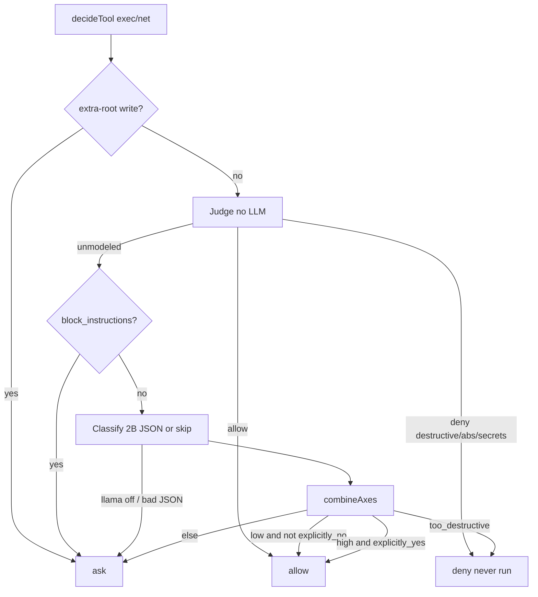

# Auto Review v2 PRO — execute bible

Status: **shipped** (2026-09-04). Spec remains the execute bible. Product code lives in `packages/runtime/src/auto-review.mjs`.

This folder is the only source of truth for the ship. Read `01` before any write. Implement one phase file at a time. Do not invent extra chrome, parsers, or stats.

## What this is

A **pre-tool** Trust pipeline for `terminal_run` / `test_run` / net tools when `approvalMode === 'auto-review'`. Shape stolen from [LM Studio Bionic Auto Review](https://lmstudio.ai/blog/how-auto-review-works) (Judge → Reviewer classify → combinator). Chain shape stolen from [LLMStack processors](https://docs.trypromptly.com/llmstack/introduction) (jailed stage in → stage out). Implementation is **Home AI original**.

It is **not**:

- The kernel **VERIFY / Critic** pass (after writes).
- Chat **Agent Review** Quick/Deep (git-diff 2B panel).
- A sandbox or Landlock.
- mvdan/sh, PowerShell AST, LLMStack install, Cursor Auto-review UI, or an 82% claim.

## Analog map (steal shape, not files)

| Foreign idea | Home AI v2 |
|---|---|
| Shell Judge (AST → capabilities → safe rules) | Deterministic `judgeShell` — argv subset, unknown → not allow |
| Shell Reviewer (classify, don't judge) | Optional local 2B JSON `{ risk, authorization, correctness }` |
| Combinator flowchart | Pure `combineAxes` — no LLM |
| Companion session DAG / rollback / fork | **Do not clone** |
| LLMStack Processor | Named stage with jailed input/config/output |
| LLMStack App | `data/permissions.json` (`approvalMode`, `autoReview`) |
| LLMStack Variables | Capability / report JSON between stages |
| LLMStack visual builder / Discord deploy | **Do not add** |

## Pipeline

Human `ask` uses existing approval IPC + `StageTrustRow`. `deny` **must not execute**. Tool result content is always `'unavailable'` (do not teach a bypass). Status line is jailed text: `auto-review · judge · allow · safe-git`.

## Phase order (do not skip)

| # | File | Ship |
|---|---|---|
| — | [SCREENS.md](SCREENS.md) | Every pane/IPC: today vs v2 vs phase. |
| 0 | [01-law-sources-current.md](01-law-sources-current.md) | Read-only. Current screens, gaps, do-not, hunt classes. |
| 1 | [02-phase-judge.md](02-phase-judge.md) | `auto-review.mjs` Judge + capability extract. Tests in 08. |
| 2 | [03-phase-classify.md](03-phase-classify.md) | Transcript jail, axes JSON, instruction bias, 2B call site. |
| 3 | [04-phase-combine-and-wire.md](04-phase-combine-and-wire.md) | Combinator, `clampApprovalMode`, `decideTool`, main deny halt. |
| 4 | [05-phase-settings-trust.md](05-phase-settings-trust.md) | Settings Trust mode + allow/block textareas. |
| 5 | [06-phase-chat-palette-git.md](06-phase-chat-palette-git.md) | Store `reviewText`, palette, GitPane, pipeline card. |
| 6 | [07-phase-telegram-kernel.md](07-phase-telegram-kernel.md) | Telegram Trust copy, KERNEL_SYSTEM honesty. |
| 7 | [08-phase-tests.md](08-phase-tests.md) | T-92 T-93 + `package.json` test list. |
| 8 | [09-phase-hunt-library.md](09-phase-hunt-library.md) | Hunt diff, AP-74+, recipe, FEATURES/TESTS/EDGES/STATUS. |

**Efficient path:** 02+03+04+08 first (runtime + tests green), then 05+06+07 (screens), then 09 (library). Do not ship UI before `deny` actually halts.

## Files this ship is allowed to touch

**Create**

- `packages/runtime/src/auto-review.mjs`
- `packages/runtime/src/auto-review.d.ts`
- `packages/runtime/src/auto-review.test.mjs`
- `RAG/recipes/auto-review.md`
- `RAG/library/features/auto-review.md`

**Edit (surgical)**

- `packages/core/src/index.ts` — `ApprovalMode` add `'auto-review'`
- `packages/runtime/src/policy.mjs` + `policy.d.ts` + `policy.test.mjs` — `clampApprovalMode`
- `packages/runtime/src/approvals.ts` — `decideTool` auto-review branch
- `packages/runtime/src/index.ts` — re-export auto-review symbols
- `apps/desktop/src/main/index.ts` — deny halt + optional 2B classify + status chunk
- `packages/agent/src/index.ts` — KERNEL_SYSTEM Verify / Auto Review sentence
- `apps/renderer/src/panes/SettingsPane.tsx`
- `apps/renderer/src/panes/StageTrustRow.tsx`
- `apps/renderer/src/panes/ChatPane.tsx`
- `apps/renderer/src/panes/GitPane.tsx`
- `apps/renderer/src/layout/CommandPalette.tsx`
- `apps/renderer/src/store/useWorkbench.ts`
- `apps/renderer/src/styles/global.css` — `.auto-review-line` only if needed
- `packages/runtime/src/telegram-chrome.mjs` + `telegram-chrome.test.mjs`
- `package.json` `test` script (append `auto-review.test.mjs` by hand)
- `RAG/recipes/INDEX.md`, `permissions-policy.md`, `kernel-loop.md`
- `RAG/library/FEATURES.md`, `TESTS.md`, `EDGES.md`, `ROADMAP.md`, `STATUS.md` via `count-status.sh`

Do not touch Wave E compute, Fleet spawn argv, DesignIR, or Cursor proprietary bits.

## Done when

1. `npm test` still all green; new file listed in `package.json`.
2. `clampApprovalMode('auto-review') === 'auto-review'`.
3. Judge allows `git status --short --branch`; asks `$()` / env assign; denies `rm -rf /` and `cat /etc/passwd`.
4. `allow_instructions` cannot auto-run `rm -rf /`.
5. Main `decision === 'deny'` returns without `runTool`.
6. Settings can select auto-review and persist allow/block via existing `takeInstructionPair`.
7. Palette + Git open the **same** Agent Review panel (`reviewText` in the store).
8. KERNEL_SYSTEM does not claim a `review` tool.
9. Recipe + feature card + T-92 T-93 + E-84 E-85 + AP records + STATUS rewritten by `count-status.sh`.
