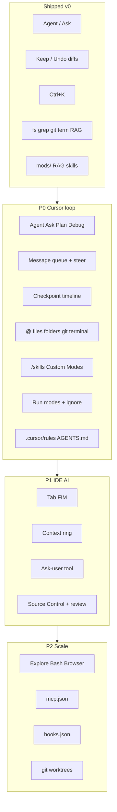

# Cursor-parity implementation plan (Home AI Workbench)

Source: [cursor.com/docs](https://cursor.com/docs) sitemap ([llms.txt](https://cursor.com/llms.txt)), read 2026-08-28.

This is **not** a clone of Cursor Inc. It is a local-first workbench that implements the **same product surfaces** Cursor documents, tuned for a 2B GGUF + optional cloud. Proprietary Cursor pieces (Instant Grep servers, Tab neural model, Cloud Agent VMs, marketplace) are **emulated** or **escalated**, never reverse-engineered.



---

## Docs inventory (what we actually implement)

Skipped on purpose: Teams/Enterprise, billing, Grok Bot, Admin/Analytics APIs, Origin hosting, JetBrains/Xcode, marketplace.

| Cursor doc | Product surface | This repo |
| --- | --- | --- |
| [Agent overview](https://cursor.com/docs/agent/overview.md) | Instructions + tools + model; checkpoints; queued / steer messages; `/goal` | Extend [`packages/agent`](packages/agent/src/index.ts) + [`ChatPane`](apps/renderer/src/panes/ChatPane.tsx) |
| [Agents Window](https://cursor.com/docs/agent/agents-window.md) | Agent-first vs editor; parallel agents | Later: activity "Agents"; v1 stays editor-first (Ctrl+I composer) |
| [Agent Review](https://cursor.com/docs/agent/agent-review.md) | Review diffs after task; Quick/Deep | Hook QA ground + optional local 2B review pass |
| [Plan Mode](https://cursor.com/docs/agent/plan-mode.md) | Questions → plan markdown → Build | New mode `plan`; save to `RAG/plans/` |
| [Prompting](https://cursor.com/docs/agent/prompting.md) | `@` context, `/` skills as modes, images, voice, context ring, model cycle | Composer input + context meter |
| [Debug Mode](https://cursor.com/docs/agent/debug-mode.md) | Hypothesize → instrument → reproduce → fix | New mode `debug`; log sink in `data/debug/` |
| [Design Mode](https://cursor.com/docs/agent/design-mode.md) | Click element in browser → edit | P3 after real browser tools |
| [Browser](https://cursor.com/docs/agent/tools/browser.md) | navigate/click/type/scroll/screenshot/console/network + approvals | Replace BrowserView-only with tool API |
| [Search](https://cursor.com/docs/agent/tools/search.md) | Grep + Explore subagent | Keep FTS/grep; add Explore subagent |
| [Security](https://cursor.com/docs/agent/security.md) | Reads free; writes on disk; terminal approval; no arbitrary net by default | Run modes |
| [Run Modes](https://cursor.com/docs/agent/security/run-modes.md) | Auto-review / Allowlist / Run Everything + sandbox | `data/permissions.json`; Linux sandbox later (this kernel lacks Landlock) |
| [Worktrees](https://cursor.com/docs/configuration/worktrees.md) | Isolated checkouts; `/best-of-n` | `git worktree` tool + UI |
| [Rules](https://cursor.com/docs/rules.md) | `.mdc` always/globs/intelligent/manual; AGENTS.md; user rules | Load Cursor paths, not only `RAG/rules` |
| [Skills](https://cursor.com/docs/skills.md) | SKILL.md, `/name`, Custom Mode, nested dirs | Discover `.cursor/skills`, `.agents/skills`, `~/.cursor/skills` |
| [MCP](https://cursor.com/docs/mcp.md) | stdio + HTTP `mcp.json` | New `packages/mcp` |
| [Hooks](https://cursor.com/docs/hooks.md) | preToolUse, afterFileEdit, beforeShellExecution… | New `packages/hooks` |
| [Subagents](https://cursor.com/docs/subagents.md) | Explore / Bash / Browser; `.cursor/agents/*.md` | Critical for 2B context |
| [Tab](https://cursor.com/help/ai-features/tab.md) | Ghost text, Tab accept, jump-in-file | FIM via llama-server if GGUF supports it; else 0.5B coder |
| [Ask mode](https://cursor.com/help/ai-features/ask-mode.md) | Read-only | Already exists |
| [Keyboard](https://cursor.com/help/customization/keyboard-shortcuts.md) | Ctrl+I/L, K, Shift+Tab, Ctrl+/ | Align remaining shortcuts |
| [Context](https://cursor.com/help/customization/context.md) | @ files, folders, terminals, chats, git, browser | Expand mention resolver |
| [Cloud Agents API](https://cursor.com/docs/cloud-agent/api/endpoints.md) | Escalate hard jobs | Already stubbed; finish run status UI |

---

## Gap vs current code

**Already close:** Agent/Ask, Keep/Undo, Ctrl+K/P/L/I, `@file`, tools, RAG, mods/skills (Home AI paths only), BrowserView capture, Cursor API launch.

**Missing vs docs (ordered by user-visible Cursor feel):**

1. Mode cycle **Agent → Ask → Plan → Debug** (`Shift+Tab`, `Ctrl+.`)
2. **Message queue** while busy; **steer** at next tool boundary (`Ctrl+Enter`)
3. **Checkpoint timeline** (restore any prior snapshot; Git stays source of truth)
4. **Cursor-compatible rules/skills** (`.cursor/rules/*.mdc`, `AGENTS.md`, skill dirs)
5. **`/` skill palette** + Custom Mode (skill stays on every turn)
6. **@ folder, @Terminals, @Chats, @git, @Browser**
7. **Ask-user tool** (clarifying questions without stopping all work)
8. **Context ring** (system / tools / rules / skills / RAG / conversation)
9. **Approvals** for shell, net, browser (allowlist file)
10. **`.cursorignore` / `.homeaiignore`**
11. **Tab ghost completions**
12. **Subagents** (Explore especially — keeps 2B context tiny)
13. **MCP + hooks**
14. **Plan markdown + Build button**
15. **Real browser tools** (not only navigate/extract)
16. **Image paste** into composer
17. **Web search** tool (query → results, not raw URL fetch only)
18. **Source Control pane** + `/agent-review`
19. **Worktrees** for parallel agents
20. **Queued `/goal`** long-lived objective

---

## Architecture additions

```
packages/agent/     Forge loop + modes + queue + checkpoints
packages/context/   @ resolver, ignore, context ring accounting
packages/rules/     .mdc + AGENTS.md + user rules merge
packages/mcp/       mcp.json client (stdio first)
packages/hooks/     hooks.json spawn JSON-stdio
packages/subagent/  Explore / Bash / Browser isolated loops
packages/tab/       FIM client to llama-server
apps/desktop/.../approvals.ts
apps/desktop/.../checkpoints.ts
apps/renderer/.../ModeBar, ContextRing, QueueList, CheckpointRail
```

Load order for instructions (Cursor precedence, local extra last):

**Team (skip) → Project `.mdc` / `AGENTS.md` → User rules → Home AI `mods/` + `RAG/rules`**

---

## Phase 0 — Compatibility loaders (1–2 days)

Make this repo speak Cursor’s on-disk language so existing Cursor projects “just work.”

- Discover and parse:
  - `.cursor/rules/**/*.mdc` (`alwaysApply`, `globs`, `description`)
  - `AGENTS.md` nested
  - `.cursor/skills/**/SKILL.md`, `.agents/skills/`, `~/.cursor/skills/`
  - `.cursorignore` + `.gitignore` (hide from tools)
- Merge into existing [`loadAllKnowledge`](packages/mods/src/index.ts)
- Settings: show discovered Cursor rules/skills next to Home AI mods
- Files: [`packages/mods/src/index.ts`](packages/mods/src/index.ts), new `packages/rules/`

**Done when:** opening this repo or another Cursor project injects `AGENTS.md` into Agent without copying files into `RAG/`.

---

## Phase 1 — The Cursor agent loop (3–5 days)

Match [Agent overview](https://cursor.com/docs/agent/overview.md) + [keyboard shortcuts](https://cursor.com/help/customization/keyboard-shortcuts.md).

### 1.1 Modes

- Extend `AgentMode` in [`packages/core`](packages/core/src/index.ts): `'agent' | 'ask' | 'plan' | 'debug'`
- `Shift+Tab` rotates; `Ctrl+.` opens mode menu ([`WorkbenchShell`](apps/renderer/src/layout/WorkbenchShell.tsx))
- Plan: research + questions → write `RAG/plans/<id>.md` → **Build** runs Agent with plan as the task
- Debug: require a repro note; add `debug_log` tool writing to `data/debug/session.jsonl`; no drive-by refactors

### 1.2 Queue and steer

- While `busy`, Enter **queues**; `Ctrl+Enter` **steers** (append to next tool round, do not kill in-flight tool)
- Stop still aborts the run
- UI: queue chips under composer ([`ChatPane`](apps/renderer/src/panes/ChatPane.tsx))

### 1.3 Checkpoints

- Replace single-origin Keep/Undo with a **stack**: snapshot all touched files before each tool write batch
- Chat timeline: click checkpoint → preview → Restore (files only, keep messages) — as docs specify
- Files: expand [`composer.ts`](apps/desktop/src/main/composer.ts)

### 1.4 Ask-user + `/goal`

- Tool `ask_user` with `questions[]`; UI modal; agent continues reads while waiting (docs: work continues)
- `/goal …` sets a sticky objective until the kernel marks it complete

**Done when:** you can Plan a feature, Build it, Undo to a mid-run checkpoint, and queue a follow-up without fighting Stop.

---

## Phase 2 — Context like Cursor (2–3 days)

From [Prompting](https://cursor.com/docs/agent/prompting.md) and [context help](https://cursor.com/help/customization/context.md).

- `@` kinds: file, folder (include tree + small files), `Terminals` (last N lines of pty), `Chats` (prior conversation md), git working/branch diff, `Browser` (last capture), `codebase` (RAG)
- `/` opens skill list; Enter = one-shot; Alt+Enter = Custom Mode badge until dismissed
- Context ring next to input: rough token buckets (system, tools, rules, skills, RAG, chat). Click = breakdown
- `Ctrl+/` cycles providers (local → openrouter → openai)
- Paste image → save `data/inbox/` and attach path (2B is text-only; cloud providers get the image)

**Done when:** `@src/ packages/agent` and `@Terminals` change the next Agent turn.

---

## Phase 3 — Approvals, ignore, safer tools (2 days)

From [Agent Security](https://cursor.com/docs/agent/security.md) and [Run Modes](https://cursor.com/docs/agent/security/run-modes.md).

- Modes: **Allowlist** (default for this box), **Ask every shell/net/browser**, **Run everything** (explicit)
- `~/.homeai/permissions.json` + workspace `.cursor/permissions.json` if present
- Reads/search never prompt; `fs_write` stays auto **inside workspace** except `.cursor/`, `.git/hooks`, secrets
- `http_fetch` / browser navigate: allowlist localhost + user list; else prompt
- Honor `.cursorignore`
- This machine: **no Landlock** (kernel/preflight already failed) — do not fake a sandbox; show “approval instead of sandbox” in Settings

**Done when:** `rm -rf` and `curl evil` cannot run without a click.

---

## Phase 4 — Subagents (the 2B multiplier) (3 days)

From [Subagents](https://cursor.com/docs/subagents.md) and [Search](https://cursor.com/docs/agent/tools/search.md).

Parent 2B must **not** eat grep dumps. Spawn isolated loops:

| Subagent | Model | Tools | Returns |
| --- | --- | --- | --- |
| Explore | local 2B, tiny ctx, parallel grep | grep, glob, fs_read | bullet summary + paths |
| Bash | local | terminal_run only | last 80 lines + exit |
| Browser | local | browser_* | URL, title, excerpt, optional screenshot path |

- Load custom `.cursor/agents/*.md` (name, description, readonly, prompt)
- Parent tool: `task` / `delegate` with `subagent_type`
- UI: nested “Explore finished” card, not raw tool spam

**Done when:** “find all auth checks” does not blow the 8k window.

---

## Phase 5 — Tab + inline K (2–3 days)

From [Tab](https://cursor.com/help/ai-features/tab.md).

- llama-server infill if the Qwen GGUF exposes FIM; else use `Qwen2.5-Coder-0.5B` already on disk under Downloads (copy or path setting)
- Ghost text in Monaco (`InlineCompletionsProvider`)
- Tab = accept; Esc = reject; Ctrl+Right = word
- After accept, optional jump to next predicted location (heuristic: next TODO/error in file)
- **Do not** attempt Cursor’s cross-file Tab portal in v1
- Inline K: stream into the selection, show as pending diff (already have Keep/Undo)

**Done when:** typing a function body in Monaco shows gray ghost text from the local model.

---

## Phase 6 — MCP, hooks, browser tools (4–6 days)

- **MCP:** parse `.cursor/mcp.json` + `~/.cursor/mcp.json`; stdio servers; tools merged into Forge with approval
- **Hooks:** `.cursor/hooks.json` — implement `preToolUse`, `afterFileEdit`, `beforeShellExecution` first (JSON stdin/stdout as docs)
- **Browser tools:** `browser_navigate`, `browser_click`, `browser_type`, `browser_screenshot`, `browser_console` via existing BrowserView + CDP-ish `executeJavaScript`; logs to files Agent can grep ([Browser doc](https://cursor.com/docs/agent/tools/browser.md) token trick)
- Design Mode (Cmd+Shift+D) **after** click/screenshot work

**Done when:** a stdio MCP (e.g. filesystem or git) shows in Mods and Agent can call it with a prompt.

---

## Phase 7 — Git, review, worktrees (2–3 days)

- Source Control pane: status, diff, commit (user confirms message)
- `/agent-review` or QA button: local model reviews `git diff` (Quick = changed hunks; Deep = + RAG related files)
- `git worktree add` for an Agent run; optional `/best-of-n` as two providers in two worktrees (expensive on 15GB RAM — default off)

---

## Phase 8 — Polish / optional

- Image generation: skip (or OpenRouter image models)
- Voice input: skip until composer is solid
- Cloud Agents: finish job list/status from existing API client
- Agents Window: split UI only if editor+composer becomes cramped
- Canvas: skip (Cursor’s `/canvas` is a separate React artifact host)

---

## Implementation order (do this)

1. Phase 0 loaders (unlock every Cursor repo as a workspace)
2. Phase 1 modes + queue + checkpoints
3. Phase 2 `@` / `/` / context ring
4. Phase 3 approvals + ignore
5. Phase 4 Explore subagent
6. Phase 5 Tab
7. Phase 6 MCP + browser tools
8. Phase 7 git review

Each phase must stay usable **offline** with the 2B. Cloud is optional muscle, never required for the loop.

---

## Explicit non-goals

- Recreating Cursor Tab’s cloud model or Instant Grep service
- Enterprise SSO, team rules dashboard, marketplace
- Pretending Landlock sandbox works on this kernel
- Unsupervised internet agent (browser stays allowlisted + confirmed)
- Copying or reverse-engineering the 3.17.21 `.deb` — inventory and reasons: [CURSOR-PACKAGE-CANNOT-REUSE.md](CURSOR-PACKAGE-CANNOT-REUSE.md)

---

## Test plan (every phase)

- Open this workspace; Agent still boots; RAG still indexes
- Open a folder that has `.cursor/rules` + `AGENTS.md`; rules appear in Mods
- Agent writes a file → checkpoint appears → Restore reverts disk
- Ask mode cannot `fs_write`
- Shell `curl` to a non-allowlisted host prompts
- Explore subagent: large grep does not appear as a 20k tool result in the parent
- Ctrl+K / Ctrl+I / Shift+Tab still match [keyboard docs](https://cursor.com/help/customization/keyboard-shortcuts.md)
